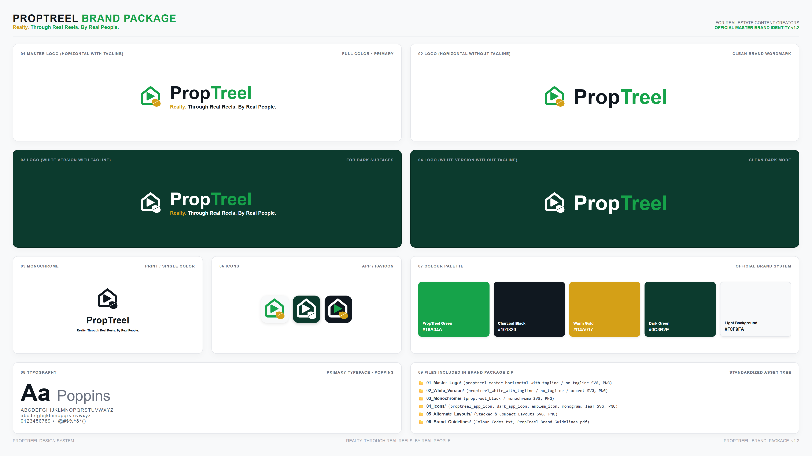

# 🎨 Antigravity Brand Kit Creator & Design System Generator

[](https://opensource.org/licenses/MIT)
[](https://github.com/chintanjoshi01/antigravity-brand-kit-creator)
[](https://www.python.org/)
[](https://flutter.dev)
[](https://tailwindcss.com)

**Antigravity Brand Kit Creator** is an automated workflow plugin for **Google Antigravity (AGY)** that empowers developers, designers, and agencies to generate enterprise-grade brand packages, 4K showcase boards, vector SVGs, high-resolution PNG rasters, brand guidelines documentation, and Flutter/Tailwind design system code tokens in seconds.

---

## 📸 Sample 4K Master Showcase Output

Below is an automated 4K Master Showcase Board generated for **PropTreel**:



---

## ✨ Features

- 🎯 **Automated Brand Package Directory Structure**:
  - `00_Brand_Package_Showcase.png` (4K 3840×2160 Master Showcase Board)
  - `BRAND_GUIDELINES.md` & `README.md` (Full specification manuals)
  - `01_Master_Logo/` (Full color horizontal SVG + 2400×800 PNG)
  - `02_White_Version/` (White reverse logo SVG + PNG for dark surfaces)
  - `03_Monochrome/` (100% Black & Grayscale SVG + PNG for single-color print)
  - `04_Icons/` (App icon squircle 1024×1024, dark app icon, emblems, monograms)
  - `05_Alternate_Layouts/` (Stacked 1200×1200 & compact header layouts)
  - `06_Brand_Guidelines/` (`Colour_Codes.txt` & print-ready PDF)
- ⚡ **Codebase Theme Token Exporters**:
  - **Flutter / Dart**: Auto-generates `app_colors.dart`, `app_typography.dart`, and `app_theme.dart`.
  - **Web / TailwindCSS**: Auto-generates `tailwind.config.js` and CSS custom properties (`theme.css`).
- 🤖 **Native Google Antigravity Skill Integration**:
  - Progressive disclosure instructions with executable Python scripts (`build_brand_package.py` and `export_theme_tokens.py`).

---

## 🚀 Quick Start & Installation

### Option 1: Install in Google Antigravity (Global)

Clone or link this repository into your global Antigravity plugins root (`~/.gemini/config/plugins/`):

```bash
cd ~/.gemini/config/plugins/
git clone https://github.com/chintanjoshi01/antigravity-brand-kit-creator.git brand-kit-creator
```

### Option 2: Install in Workspace (`.agents/plugins`)

Add to your current Flutter or Web workspace:

```bash
mkdir -p .agents/plugins
cd .agents/plugins
git clone https://github.com/chintanjoshi01/antigravity-brand-kit-creator.git brand-kit-creator
```

---

## 💻 How to Use in Antigravity

Ask your Antigravity agent in natural language:

> *"@workspace Create a brand kit and Flutter theme tokens for my app 'PropTreel' with primary green #16A34A, charcoal #101820, and gold accent #D4A017."*

Or trigger the slash command:

```bash
/brand-kit --name "PropTreel" --primary "#16A34A" --accent "#D4A017" --tagline "Realty. Through Real Reels."
```

---

## 📂 Generated Brand Package Layout

```text
PropTreel_Brand_Package_v1.0/
├── 00_Brand_Package_Showcase.png               # 4K Master Showcase Board
├── BRAND_GUIDELINES.md                          # Full Identity Manual
├── README.md                                    # Quick Reference Guide
│
├── 01_Master_Logo/                              # Horizontal Master Logo (SVG + PNG)
├── 02_White_Version/                           # White Reverse Logo (SVG + PNG)
├── 03_Monochrome/                              # 100% Black & Grayscale Logo (SVG + PNG)
├── 04_Icons/                                   # App Icon 1024x1024, Monograms & Emblems
├── 05_Alternate_Layouts/                       # Vertical Stacked & Compact Layouts
└── 06_Brand_Guidelines/                        # Color Codes text file & PDF
```

---

## 🤝 Call for Open-Source Contributors!

We welcome contributions from designers, frontend engineers, and AI developers! Help us make this the #1 brand identity generator for AI coding assistants.

### 🌟 How You Can Contribute:
1. **Theme Generators**: Add token exporters for **React / Next.js**, **SwiftUI (iOS)**, **Jetpack Compose (Android)**, **Vue**, or **Svelte**.
2. **Figma Integration**: Build Model Context Protocol (MCP) servers to sync directly with Figma API.
3. **Showcase Templates**: Design new 4K visual showcase board layouts.
4. **Docs & Guides**: Improve brand guidelines markdown templates and print PDF builders.

Please read our [CONTRIBUTING.md](CONTRIBUTING.md) guide to get started!

---

## 🗺️ Roadmap

- [x] Initial AGY Skill & Plugin release (`v1.0.0`)
- [x] 4K Showcase board generator & SVG vector builder
- [x] Flutter & TailwindCSS token exporter
- [ ] Figma API integration via MCP Server
- [ ] VS Code Extension / Open VSX Market release
- [ ] Web-based Micro-SaaS generator

---

## 📄 License

Distributed under the **MIT License**. See [`LICENSE`](LICENSE) for details.

Developed with ❤️ by **[Chintan Joshi](https://github.com/chintanjoshi01)** for the Antigravity Community.
